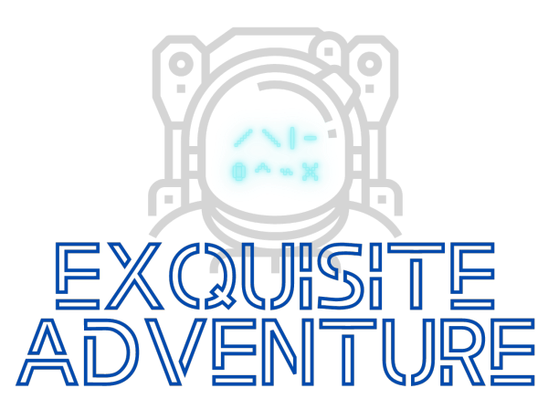
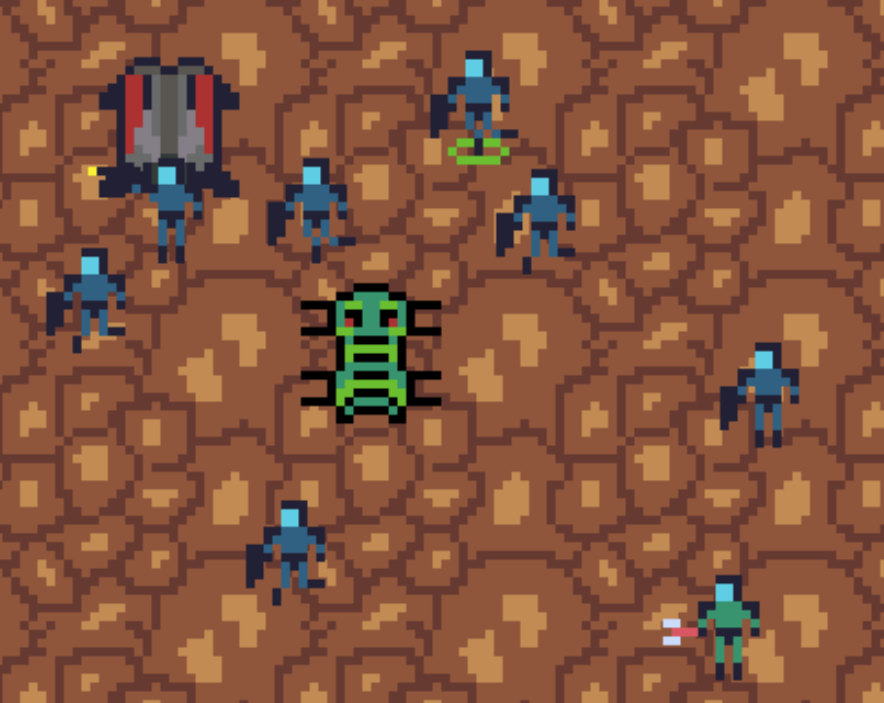

# Projects

* * *

## Exquisite Adventure

    

* <u>About</u>: This is my current app I am working on and is slated for a Q1 2021 release  Development is currently focused on iOS but an Android version will be available as well. The project is written with Boardhouse and uses Cordova to target native mobile platforms. It will feature an [Exquisite Corpse](https://en.wikipedia.org/wiki/Exquisite_corpse) artistic mode where users can contribute to creating entities that will be seen in other parts of the app. Project goals are to learn more about mobile development and to better understand both the iOS and Android ecosystems.
* Tech used: Cordova, XCode, TypeScript, Webpack, Babel, Node, Three.js

* * *

## BoardhouseTS

    

* Source code: [https://github.com/jjwall/BoardhouseTS](https://github.com/jjwall/BoardhouseTS)
* Site: [https://jjwall.github.io/BoardhouseTS/](https://jjwall.github.io/BoardhouseTS/)
* <u>About</u>: This is an onging project written in TypeScript. It is a game engine for browsers. The project goals are to enable users to quickly develop prototypes, which makes it a perfect game engine to use for weekend game dev competitions such as Ludum Dare, Global Game Jam, and Game Makers Tool Kit. The engine features a React-like UI layer, an Entity Component System, State management for handling scenes, and uses Three.js as the rendering layer. Currently I am in the process of using Cordova to enable exporting projects into native iOS and Android code.

* * *

## Global Game Jam 2020: Occupational Hazards

    

* Play it here: [https://alchemical.itch.io/occupational-hazards](https://alchemical.itch.io/occupational-hazards)
* Global Game Jam submission: [https://globalgamejam.org/2020/games/occupational-hazards-5](https://globalgamejam.org/2020/games/occupational-hazards-5)
* Source code: [https://github.com/apples/ggj2020](https://github.com/apples/ggj2020)
* Tech used: TypeScript, Webpack, Babel, Node, Three.js
* <u>About</u>: This was a game written in my game engine, BoardhouseTS, by three developers (see below) for the 2020 Global Game Jam. I was not part of the team that wrote any of the game code, I only provided the engine code. Very little communication was needed from me for them to consume the APIs exposed by my game engine. The game got 4th place at the Houston, TX branch of GGJ.

Developed by:
* [apples](https://github.com/apples/) - **Jeramy Harrison**
* [jrvaughan917](https://github.com/jrvaughan917/) - **James Vaughan**
* [WiredOverload](https://github.com/WiredOverload/) - **Michael Hodges**

* * *

## Super Robot Wars

    

* Play it here: [https://srw-og2-multiplayer.herokuapp.com/](https://srw-og2-multiplayer.herokuapp.com/)
* Source code: [https://github.com/MagentaReds/project-3-srw-multiplayer](https://github.com/MagentaReds/project-3-srw-multiplayer)
* Tech used: jQuery, jQuery UI, Node.js, Express.js, MongoDB, Mongoose, Socket.io, Embeddedjs, Passport, Bootstrap 
* <u>About</u>: This app was built for my final project at the UT Coding Bootcamp with 2 other cohorts. It is a multiplayer tactical role-playing game based off of the Bandai series Super Robot Wars. I was in charge of building the gameplay UI on the front-end and intergrating socket.io so that the various clients playing would remained synced. Since games of this genre are typically designed to be single player games, I assisted our group's game engine developer with much of the game design to ensure that gameplay was fair. 

* * *

## Ludum Dare 45: Space Base Continuum

    

* Play it here: [https://gizmolo.itch.io/space-base-continuum](https://gizmolo.itch.io/space-base-continuum)
* Ludum Dare submission: [https://ldjam.com/events/ludum-dare/45/space-base-continuum](https://ldjam.com/events/ludum-dare/45/space-base-continuum)
* Source code: [https://github.com/jjwall/LD45](https://github.com/jjwall/LD45)
* Tech used: TypeScript, Webpack, Babel, Node, Three.js
* <u>About</u>: The project was also developed using my game engine, BoardhouseTS, for Ludum Dare 45. I was the sole developer of the game code and also created all the art and sound assets used in the game. My inspiration was to try and create a simpler version of StarCraft. My learning goals were to understand how to currently implement MouseEvents into my engine.

* * *

## Global Game Jam 2019: Pale Blue Dot

    

* Play it here: [https://wiredoverload.itch.io/pale-blue-dot](https://wiredoverload.itch.io/pale-blue-dot)
* Global Game Jam submission: [https://globalgamejam.org/2019/games/pale-blue-dot-2](https://globalgamejam.org/2019/games/pale-blue-dot-2)
* Source code: [https://github.com/WiredOverload/PaleBlueDot](https://github.com/WiredOverload/PaleBlueDot)
* Tech used: TypeScript, Webpack, Node, Three.js
* <u>About</u>: This was the first project where I pulled in additional developers to build a game using my game engine, BoardhouseTS. It was also the first time I got a chance to compete in a Global Game Jam. I worked on the code for the asteroids and creating the visual assets.

Developed by:
* [apples](https://github.com/apples/) - **Jeramy Harrison**
* [jjwall](https://github.com/jjwall/) - **Jacob Wallace**
* [WiredOverload](https://github.com/WiredOverload/) - **Michael Hodges**

* * *

## **Ludum Dare 43: Creatures of the Night**

    

* Play it here: [https://gizmolo.itch.io/creatures-of-the-night](https://github.com/jjwall/)
* Ludum Dare submission: [https://ldjam.com/events/ludum-dare/43/creatures-of-the-night](https://ldjam.com/events/ludum-dare/43/creatures-of-the-night)
* Source code: [https://github.com/jjwall/LD43](https://github.com/jjwall/LD43)
* Tech used: TypeScript, Webpack, Node, PixiJS
* <u>About</u>: This was the first game I developed using my game engine, BoardhouseTS. It used a much older version of my engine that used PixiJS as the rendering layer. PixiJS has since been thrown out in favor of Three.js.