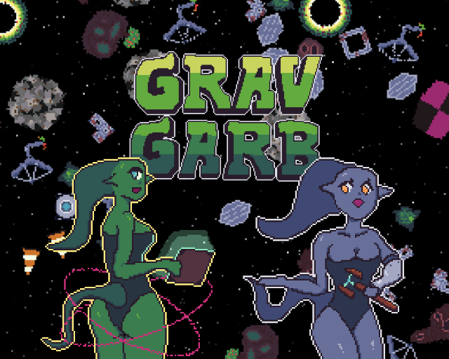
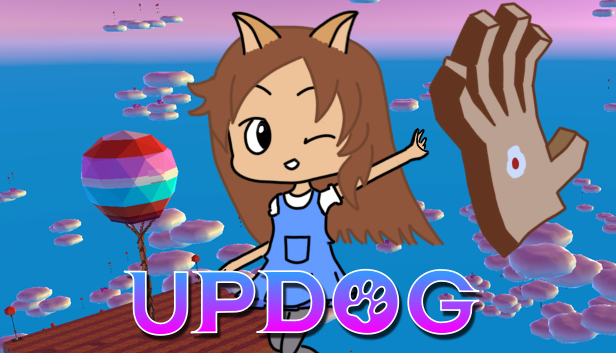
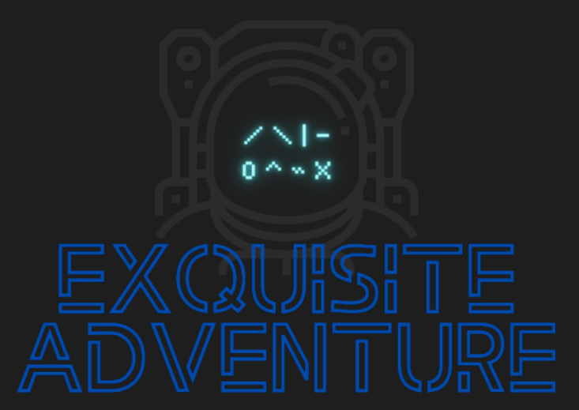
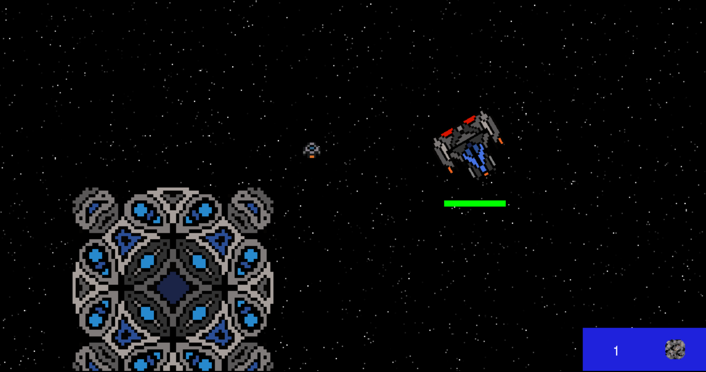
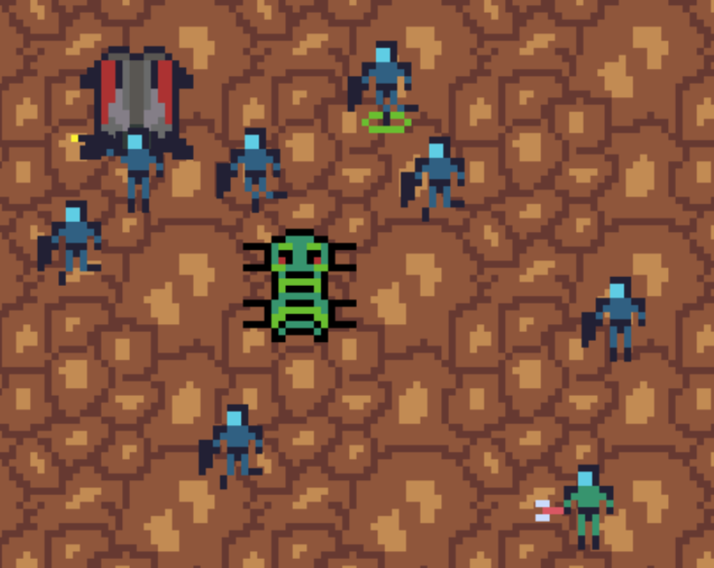
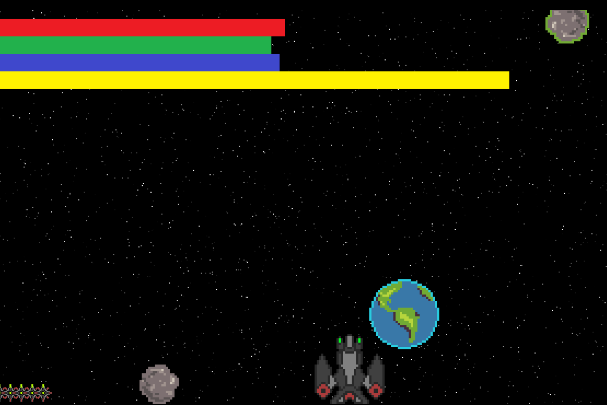
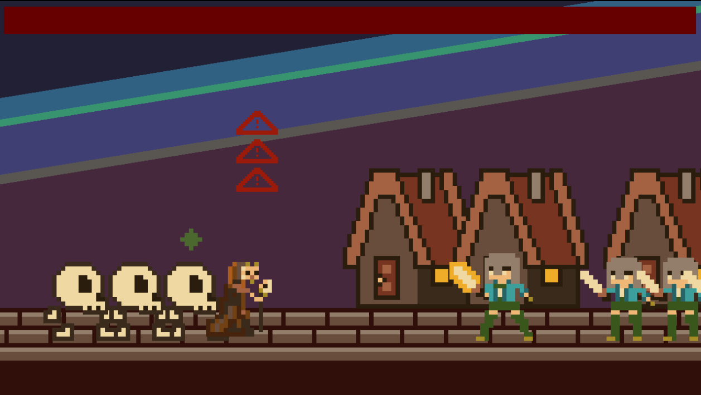

# Projects
<b>[Home](./)</b> | <b>Projects</b> | <b>[Resume](./resume.html)</b>
* * *

Many of my side projects come from a weekend hackathon game jam competition called Ludum Dare. You can check out my entire portofolio of games from there following this [link](https://ldjam.com/users/gizmolo/games). Below I've highlighted some of my notable projects.

## Grav Garb

    

* Play it here: [https://alchemical.itch.io/grav-garb](https://alchemical.itch.io/grav-garb)
* Ludum Dare submission: [https://ldjam.com/events/ludum-dare/53/grav-garb](https://ldjam.com/events/ludum-dare/53/grav-garb)
* Source code: [https://github.com/apples/ludum-dare-53](https://github.com/apples/ludum-dare-53)
* Tech used: Godot 4.0, ASP.NET, Aseprite, LMMS, JSFXR
* <u>About</u>: My team's submission for Ludum Dare 53! This was my first game project where I was extensively involved with the game programming using Godot. As Godot 4.0 was released shortly before the competition, I used the jam as a good excuse to learn Godot. I am incredibly impressed with how much fun Godot is to build games with! This game was also made with 6 other people so it was the biggest team I've ever been a part of for a game jam competition. We all worked so well together :)

* * *

## Updog

    

* Steam page: [https://store.steampowered.com/app/1967010/Updog/](https://store.steampowered.com/app/1967010/Updog/)
* Ludum Dare submission: [https://ldjam.com/events/ludum-dare/50/updog-the-ascension-of-180-sadie](https://ldjam.com/events/ludum-dare/50/updog-the-ascension-of-180-sadie)
* Source code: [https://github.com/apples/ld50](https://github.com/apples/ld50)
* Tech used: Unity, Blender, Krita, Aseprite, Logic Pro
* <u>About</u>: This was my first game I ever published to Steam! I worked with a team of three other developers and used the company Moonflower Games as the publisher. The game started out as a Ludum Dare Jam entry for LD 50 and since the team enjoyed working with each other so much we decided to expand it and launch a Steam release. Working on this game was my first real experience with Unity.

* * *

## Exquisite Adventure

    

* Tech used: Cordova, XCode, TypeScript, Webpack, Babel, Node, Three.js
* <u>About</u>: This project is written with Boardhouse and uses Cordova to target native mobile platforms. It features an [Exquisite Corpse](https://en.wikipedia.org/wiki/Exquisite_corpse) artistic mode where users can contribute to creating entities that will be seen in various parts of the app. Project goals are to learn more about mobile development and to better understand both the iOS and Android ecosystems.

* * *

## BoardhouseTS

    

* Source code: [https://github.com/jjwall/BoardhouseTS](https://github.com/jjwall/BoardhouseTS)
* Site: [https://jjwall.github.io/BoardhouseTS/](https://jjwall.github.io/BoardhouseTS/)
* <u>About</u>: This is an onging project written in TypeScript. It is a game engine for browsers. The project goals are to enable users to quickly develop prototypes, which makes it a perfect game engine to use for weekend game dev competitions such as Ludum Dare, Global Game Jam, and Game Makers Tool Kit. The engine features a React-like UI layer, an Entity Component System, State management for handling scenes, and uses Three.js as the rendering layer. Currently I am in the process of using Cordova to enable exporting projects into native iOS and Android code.

* * *

## Global Game Jam 2020: Occupational Hazards

    

* Play it here: [https://alchemical.itch.io/occupational-hazards](https://alchemical.itch.io/occupational-hazards)
* Global Game Jam submission: [https://globalgamejam.org/2020/games/occupational-hazards-5](https://globalgamejam.org/2020/games/occupational-hazards-5)
* Source code: [https://github.com/apples/ggj2020](https://github.com/apples/ggj2020)
* Tech used: TypeScript, Webpack, Babel, Node, Three.js
* <u>About</u>: This was a game written in my game engine, BoardhouseTS, by three developers (see below) for the 2020 Global Game Jam. I was not part of the team that wrote any of the game code, I only provided the engine code. Very little communication was needed from me for them to consume the APIs exposed by my game engine. The game got 4th place at the Houston, TX branch of GGJ.

Developed by:
* [apples](https://github.com/apples/) - **Jeramy Harrison**
* [jrvaughan917](https://github.com/jrvaughan917/) - **James Vaughan**
* [WiredOverload](https://github.com/WiredOverload/) - **Michael Hodges**

* * *

## Super Robot Wars

    

* Play it here: [https://srw-og2-multiplayer.herokuapp.com/](https://srw-og2-multiplayer.herokuapp.com/)
* Source code: [https://github.com/MagentaReds/project-3-srw-multiplayer](https://github.com/MagentaReds/project-3-srw-multiplayer)
* Tech used: jQuery, jQuery UI, Node.js, Express.js, MongoDB, Mongoose, Socket.io, Embeddedjs, Passport, Bootstrap 
* <u>About</u>: This app was built for my final project at the UT Coding Bootcamp with 2 other cohorts. It is a multiplayer tactical role-playing game based off of the Bandai series Super Robot Wars. I was in charge of building the gameplay UI on the front-end and intergrating socket.io so that the various clients playing would remained synced. Since games of this genre are typically designed to be single player games, I assisted our group's game engine developer with much of the game design to ensure that gameplay was fair. 

* * *

## Ludum Dare 45: Space Base Continuum

    

* Play it here: [https://gizmolo.itch.io/space-base-continuum](https://gizmolo.itch.io/space-base-continuum)
* Ludum Dare submission: [https://ldjam.com/events/ludum-dare/45/space-base-continuum](https://ldjam.com/events/ludum-dare/45/space-base-continuum)
* Source code: [https://github.com/jjwall/LD45](https://github.com/jjwall/LD45)
* Tech used: TypeScript, Webpack, Babel, Node, Three.js
* <u>About</u>: The project was also developed using my game engine, BoardhouseTS, for Ludum Dare 45. I was the sole developer of the game code and also created all the art and sound assets used in the game. My inspiration was to try and create a simpler version of StarCraft. My learning goals were to understand how to currently implement MouseEvents into my engine.

* * *

## Global Game Jam 2019: Pale Blue Dot

    

* Play it here: [https://wiredoverload.itch.io/pale-blue-dot](https://wiredoverload.itch.io/pale-blue-dot)
* Global Game Jam submission: [https://globalgamejam.org/2019/games/pale-blue-dot-2](https://globalgamejam.org/2019/games/pale-blue-dot-2)
* Source code: [https://github.com/WiredOverload/PaleBlueDot](https://github.com/WiredOverload/PaleBlueDot)
* Tech used: TypeScript, Webpack, Node, Three.js
* <u>About</u>: This was the first project where I pulled in additional developers to build a game using my game engine, BoardhouseTS. It was also the first time I got a chance to compete in a Global Game Jam. I worked on the code for the asteroids and creating the visual assets.

Developed by:
* [apples](https://github.com/apples/) - **Jeramy Harrison**
* [jjwall](https://github.com/jjwall/) - **Jacob Wallace**
* [WiredOverload](https://github.com/WiredOverload/) - **Michael Hodges**

* * *

## **Ludum Dare 43: Creatures of the Night**

    

* Play it here: [https://gizmolo.itch.io/creatures-of-the-night](https://gizmolo.itch.io/creatures-of-the-night)
* Ludum Dare submission: [https://ldjam.com/events/ludum-dare/43/creatures-of-the-night](https://ldjam.com/events/ludum-dare/43/creatures-of-the-night)
* Source code: [https://github.com/jjwall/LD43](https://github.com/jjwall/LD43)
* Tech used: TypeScript, Webpack, Node, PixiJS
* <u>About</u>: This was the first game I developed using my game engine, BoardhouseTS. It used a much older version of my engine that used PixiJS as the rendering layer. PixiJS has since been thrown out in favor of Three.js.