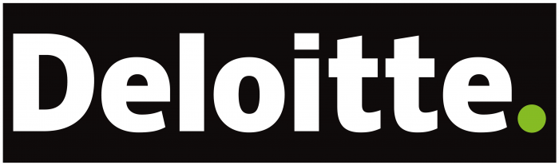
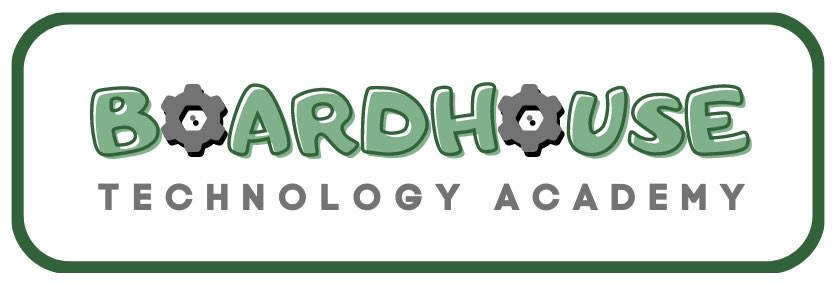
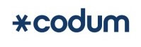

# Resume
<b>[Home](./)</b> | <b>[Writings](./writings.html)</b> | <b>[Projects](./projects.html)</b> | <b>[Art](./art.html)</b> | <b>Resume</b>
* * *

Below you can find a snapshot of my professional, academic, and charitable endeavors. If you are interested in working with me or would like to see a copy of my resume in PDF format—add and reach out to me on Discord (<b>gizmolo</b>).

# Work Experience
## Deloitte

    

<b>AI Engineering Manager, Cyber AI Innovations Portfolio</b> 
<i>San Francisco, CA, June 2024 - Current</i> 
Engineering manager over all of Cyber AI’s internally developed innovation projects. This portfolio is comprised of seven (and counting!) asset accelerators—including, but not limited to:
* <b>TPRM Accelerator</b> - an on-device AI-powered TPRM service accelerator tool that reduces the amount of time TPRM analysts have to spend reviewing TPRM security documentation and answering TPRM questionnaires.
* <b>Digital Analyst</b> - an AI-powered SaaS used by SOC analysts to rapidly support their triage of security alerts using advanced AI techniques to process current security alert information and historical triages.
* <b>Pathfinder</b> - an AI-powered Cyber Security as a Service platform to facilitate Cyber Security processes across all cyber domains.

---

<b>AI Technical Lead, Hybrid AI Innovations (Deloitte US Strategy)</b> 
<i>Austin, TX, January 2024 - June 2024</i>
* Tech used: Python, TypeScript, VS Code, VS Code Plugin Extensions Development Framework, Ollama, Huggingface, Intel's OpenVINO, Qualcomm Neural Network
* Led application engineering, architectural design, and AI development for Dell with the Hybrid AI group under Deloitte US Strategy. Spearheaded the creation of "Neuron," a Copilot-like coding assistant that leverages on-device AI to provide code suggestions while ensuring complete privacy over the AI-scanned codebase. Delivered key innovations that enhanced developer productivity and maintained strict data security protocols.
* In addition to this, I was a technical lead over an Deloitte US Strategy platform known as “Celium” supporting Intel which was used to fine tune and optimize on-device AI processes on top of Intel & its competitors’ CPU, GPU, & NPU chip architectures. This project explored open source and commercially available black box technologies to discover the best configuration for on-device AI processing. Some model platforms and frameworks that were used as part of the platform were Intel’s OpenVINO, Huggingface, Ollama, as well as Qualcomm’s QNN.

---

<b>Lead Software Architect, Military Health System</b> 
<i>Washington, D.C., October 2021 - January 2024</i>
* Tech used: TypeScript, Deno, Node.js, React, React Native, Wickr SDK, AWS Console, AWS CodeCommit, AWS CodePipeline, AWS CodeDeploy
* Technical lead, developer & architect of METCC-P medic bots built atop AWS Wickr, an NSA approved end-to-end encrypted Voice Over Internet Protocol Communication system. 
* This team helped to pioneer the US Military to transition from antiquated communication systems to modern communication protocols.
* In addition to this, I was responsible for traveling to various U.S. military bases across the country to conduct in-person training sessions. These sessions were designed to simulate active combat scenarios, focusing on the NETCCN / METCC-P medic bot communication system, and were attended by large groups of military personnel.

---

<b>Lead Software Developer, Application Modernization & Innovation</b> 
<i>Washington, D.C., August 2021 - October 2021</i>
* Tech used: TypeScript, Angular, Node.js, NPM, Webpack, MongoDb, VS Code, Git, GitHub
* Led development efforts as part of the JAIMI Cross-Military CRM project categorizing weapon systems data across all US Alliances stored in NIPR and SIPR networks.

## T-Cetra

    

<b>Mid-Level Software Developer</b> 
<i>Dublin, OH, February 2021 - July 2021</i> 
* Tech used: TypeScript, Angular, C#, .NET Core, SQL, Git, Azure DevOps
* Assisted in upgrading existing systems by making them more modular, extendable, 
and efficient as a member of the Refactoring Team.
* Implemented third-party APIs to outsource credit card security to TokenEx by 
tokenizing existing and newly added credit card data.

## Reynolds & Reynolds

    

<b>Software Developer</b> 
<i>Houston, TX, October 2017 - January 2021</i> 
* Tech used: TypeScript, JavaScript, React, Redux, Node.js, NPM, JQuery, C#, ASP.NET MVC, SQL
* Ensured integrity and security of software for the Support and Admin applications of Hosted Web Application Platform team (HWAP).
* Created cross-application logging for developer support and permission items for global platform security.

---

# Education
## UT Coding Bootcamp

    

<i>Austin, TX, January 2017 - July 2017</i>
* Certificate: Full Stack Web Development
* Powered by: Trilogy Education (now edX)

## The University of Texas at Austin

    

<i>Austin, TX, January 2012 - June 2016</i>
* Major: Economics
* Minor: Business Foundations

---

# Volunteer Service
## Boardhouse Technology Academy

    

<b>Founder, Senior Code Mentor </b> 
<i>San Diego, CA, October 2022 - January 2024</i>
* Founded and led a coding mentorship academy offering both paid and scholarship-based “Zero-to-Hero” programs for aspiring and pivoting software developers.
* Designed, developed, and taught the proprietary Boardhouse Technology Academy Coding Curriculum, guiding students from beginner to industry-ready.
* Mentored students across all career stages—from first-time coders to experienced professionals seeking upward mobility in the tech industry.
* Recruited and led a volunteer team of Code Mentors and Executive Student Success Coaches to support mentees’ technical growth and job readiness.
* Advised students on navigating alternative education pathways and bootcamps, tailoring recommendations to individual financial, time, and learning needs.
* Supported multiple mentees in securing six-figure job offers, contributing to a high-impact success rate within the Academy’s active period.

## Codum

    

<b>Software Developer Mentor, Codum Brand Ambassador</b> 
<i>Germany, Upper Bavaria, November 2022 - November 2023</i>
* Mentored junior developers helping them navigate their coding learning journies as well as their career growth & development.
* Ambassador for the organization spreading the word through my professional network and social media channels.

## Code Ninjas

    

<b>Sensei</b> 
<i>Houston, TX, July 2019 - October 2022</i>
* Office administrator for the Tanglewood branch in Houston, TX, the most successful branch by revenue earned across the globe.
* Curated materials and coursework for the Tanglewood branch's coding curriculum.