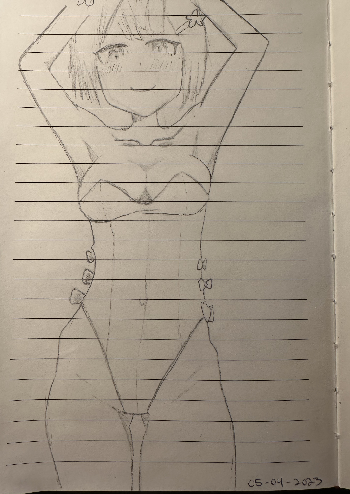
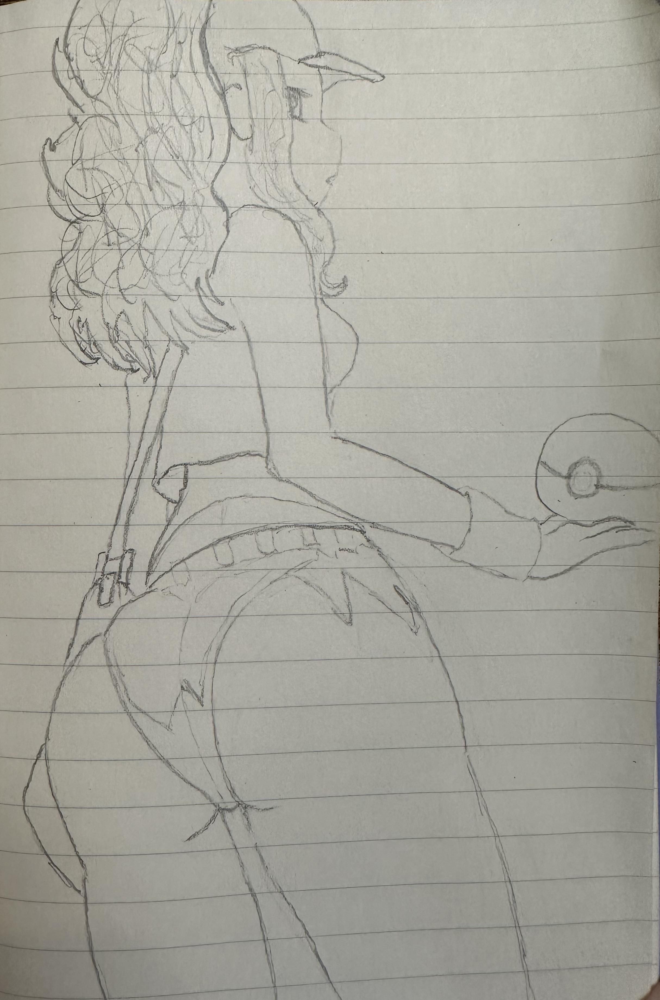
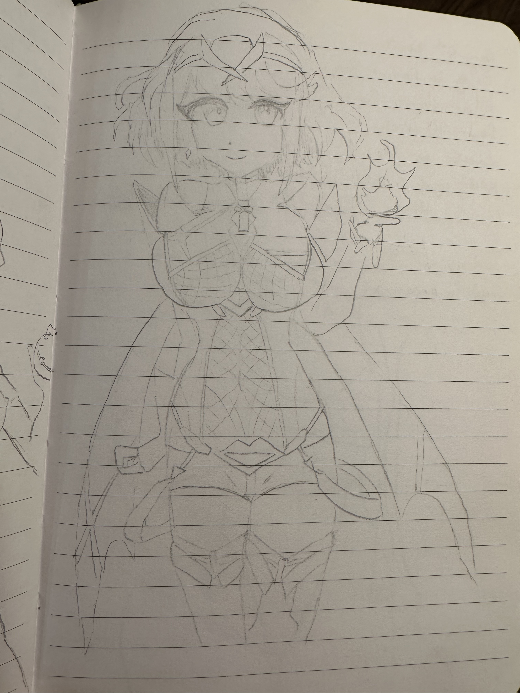
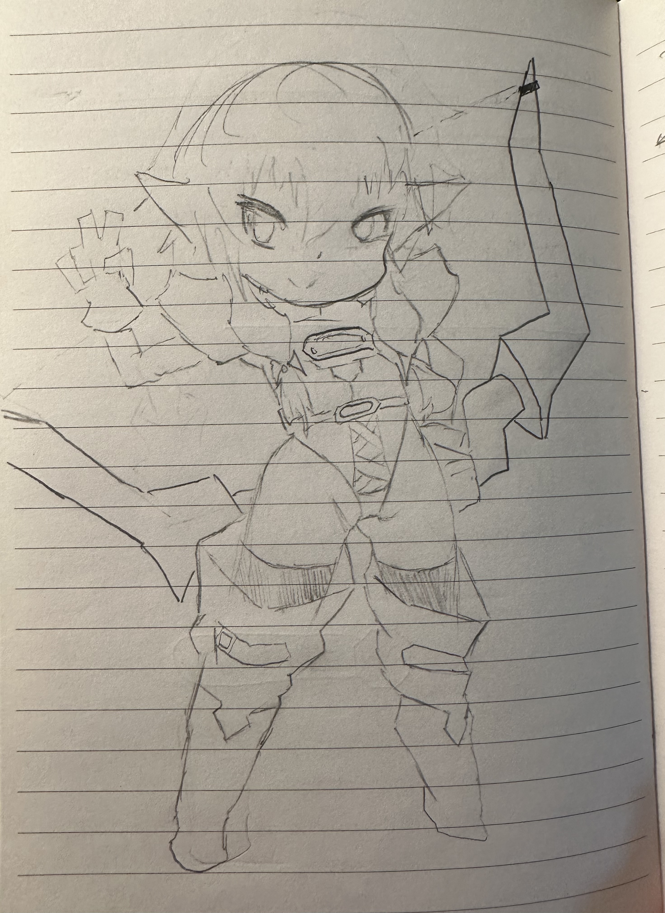
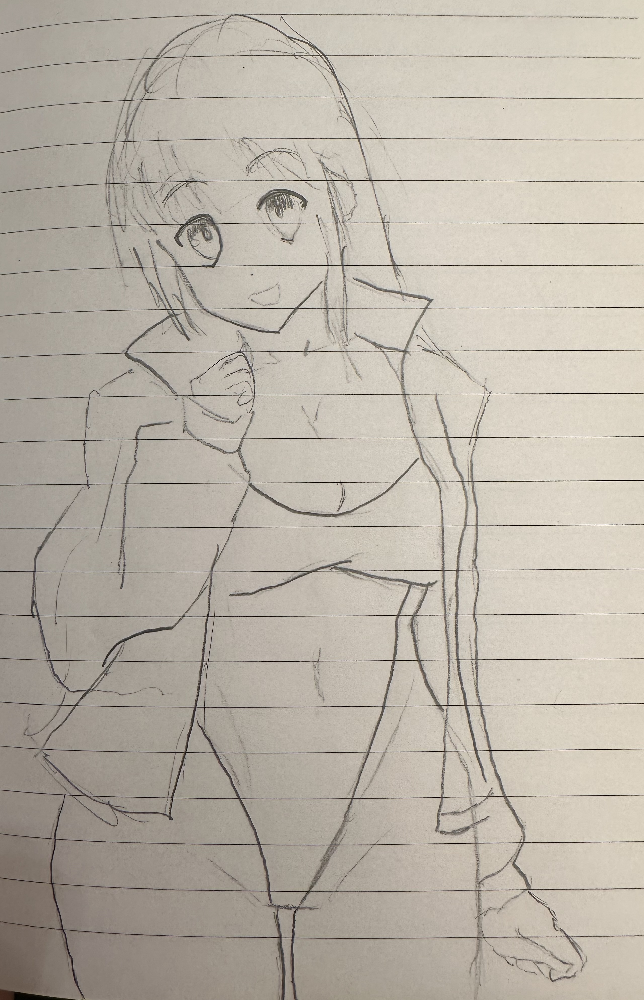

# Home
<b>[Home](./)</b> | <b>[Poems](./poems.html)</b> | <b>[Projects](./projects.html)</b> | <b>[Music](./music.html)</b> | <b>[Resume](./resume.html)</b> | <b>[Blog](./blog.html)</b>
* * *

Cool! You found an unrouted page 🐣 Ever since I was a kid, beautiful women have always been an artistic inspiration for my drawings. Kind of like a song you hear and you just HAVE to learn how to play it on your instrument of choice - I'll see art on Twitter or in an artbook and have to do my own sketch of it. Below you'll find some of these doodles I've done over the last couple of years :D

New blurb might read: The Divine Feminine has always inspired my art. There's nothing I'd rather draw then the Female Body. The following are some sketches I've made over the years:

    

    

    

    

    

    

    

